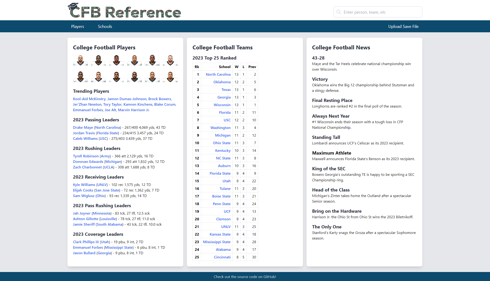

<h1 align="center">
    <a href="https://cfb.hansmissenhe.im">
    
    </a>
</h1>

<p align="center">
  📊 Self-hosted sports statistics website using NCAA game saves.
</p>
<p align="center">
<a href="https://github.com/hansmissenheim/cfb-reference/actions?query=workflow%3ATest" target="_blank"></a>
</p>



**CFB Reference** is a personalized college football statistics database and website, created directly from your own EA Sports NCAA dynasty save files. Mirroring the experience of diving deep into sports statistics and history on similar reference sites, CFB Reference enhances the dynasty experience by offering expanded stats tracking within a modern website, built with FastAPI and HTMX.

## Demo

A live instance of CFB Reference is available at [cfb.hansmissenhe.im](https://cfb.hansmissenhe.im)

## Why?

While sports has seemingly been taken over by analytics, sports video games often lack in-depth statistical analysis seen in the real world. Many games, including the EA Sports NCAA series, have limited team and player statistics available and often remove practically all data from previous years. This leaves sports fans looking for a similar experience with their in-game world disappointed or spending many hours manually keeping track of what is available. CFB Reference addresses this by expanding the statistics tracking featured in the games with:

- Statistics available for all past years
- Tracking of players' and coaches' previous teams
- Advanced stats missing from the in-game interface

Previous tools have been created to provide players with these features but usually require manual user input or the use of extra tools to export data. CFB Reference accomplishes more while providing an easy one-click upload of the entire save file, powered by the [ncaadb](https://github.com/hansmissenheim/ncaadb) python library. The data is displayed in a familiar, yet modern interface that can be hosted and shared easily, all while never having to open the game itself.

## Preview
Below are previews of some example pages within CFB Reference. A page is created for each and every Player, School, Team, and Game and every year's history is preserved to showcase your dynasty.

<h3 align="center">Player Page</h3>
<p align="center">
    
</p>

<h3 align="center">School History Page</h3>
<p align="center">
    
</p>

<h3 align="center">Team Page</h3>
<p align="center">
    
</p>

<h3 align="center">Upload Form</h3>
<p align="center">
    
</p>

## Host locally

Docker must be installed to host CFB reference on your local machine, which can be done using [this guide](https://docs.docker.com/get-docker/). After installation, run the following commands:

```bash
docker pull hansmissenheim/cfb-reference:latest
docker run -p 8000:80 hansmissenheim/cfb-reference:latest
```

After that, an instance of CFB Reference will be accessible at [localhost:8000](http://localhost:8000).

## Contributing

### Clone the repo

```bash
git clone https://github.com/hansmissenheim/play-prediction@latest
cd play-prediction
```

### Install [Poetry](https://github.com/python-poetry/poetry) if not installed
```bash
curl -sSL https://install.python-poetry.org
```

### Install dependencies
```bash
poetry install
poetry shell
```

### And run the application
```bash
flask --app app/app.py --debug run
```

### Submit a pull request

If you would like to contribute to the project, create a fork and open a pull request on the `main` branch.
